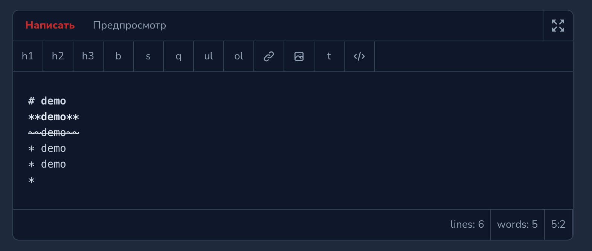
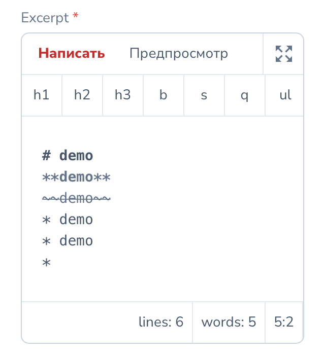

# Nova Markdown

[](https://packagist.org/packages/stepanenko3/nova-markdown)
[](https://packagist.org/packages/stepanenko3/nova-markdown)
[](https://packagist.org/packages/stepanenko3/nova-markdown)


## Description

Extended Markdown Field for Laravel Nova based on native Nova field

## Features

- Many toolbar actions
- Status bar
- Toolbar actions toggable
- Customizable toolbar and status bar
- Dark mode
- Responsive
- Full screen
- Preview

## Requirements

- `php: >=8.0`
- `laravel/nova: ^4.0`

## Installation

```bash
# Install the package
composer require stepanenko3/nova-markdown
```

Publish the config file:

``` bash
php artisan vendor:publish --provider="Stepanenko3\NovaMarkdown\FieldServiceProvider" --tag="config"
```

## Usage

Add the use declaration to your resource and use the fields:

```php
use Stepanenko3\NovaMarkdown\Markdown;
...

Markdown::make('Excerpt', 'excerpt')
    ->rules('required', 'max:1000')
    ->alwaysShow(),
```

## Configuration

All the configuration is managed from a single configuration file located in `config/nova-markdown.php`

You can change the presence and order of the toolbar actions from the list

```php
[
    'h1',
    'h2',
    'h3',
    // 'headingSmaller',
    // 'headingBigger',
    'bold',
    'italic',
    'strikethrough',
    'quote',
    'unorderedList',
    'orderedList',
    'link',
    'image',
    'table',
    // 'horizontalRule',
    'code',
]
```

And status bar

```php
[
    'lines', // Show number of lines
    'words', // Show number of words
    'cursor', // Current cursor position line:word
]
```

## Screenshots




## Credits

- [Artem Stepanenko](https://github.com/stepanenko3)

## Contributing

Thank you for considering contributing to this package! Please create a pull request with your contributions with detailed explanation of the changes you are proposing.

## License

This package is open-sourced software licensed under the [MIT license](LICENSE.md).
